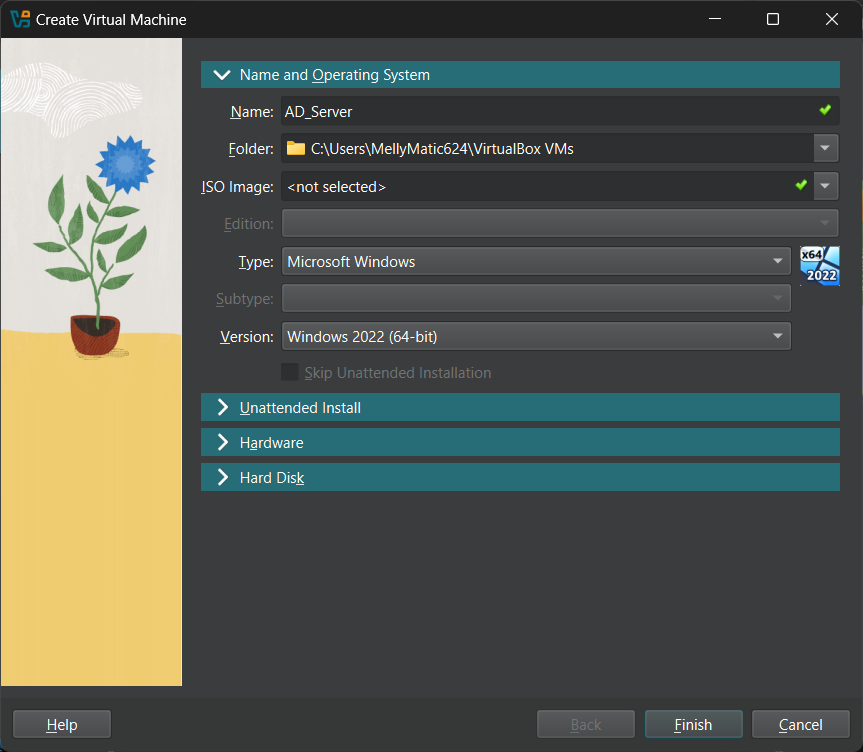
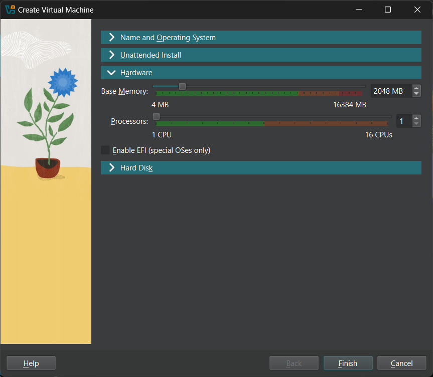
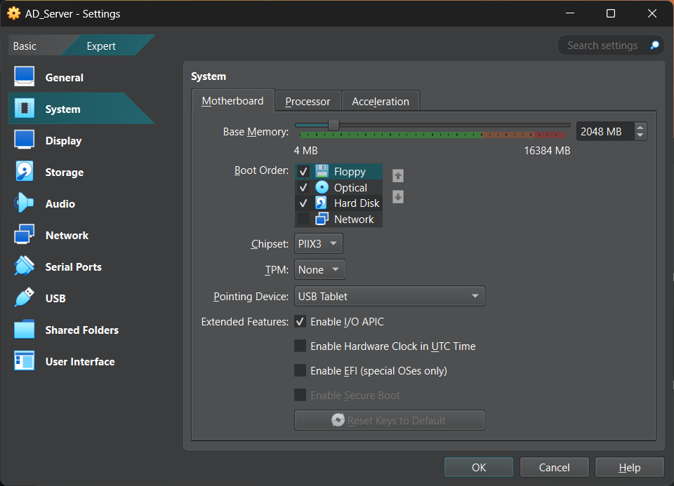
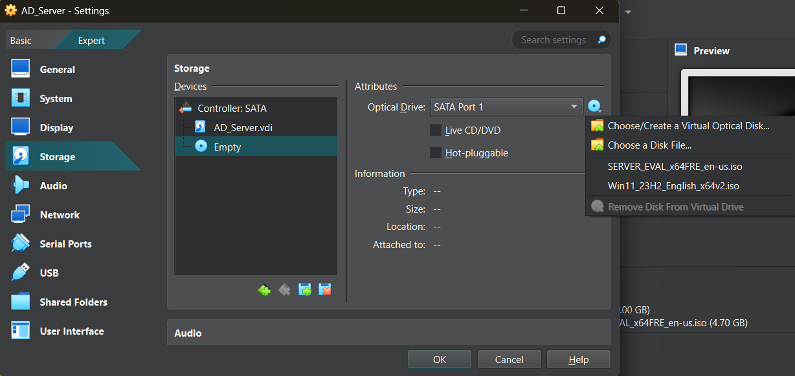
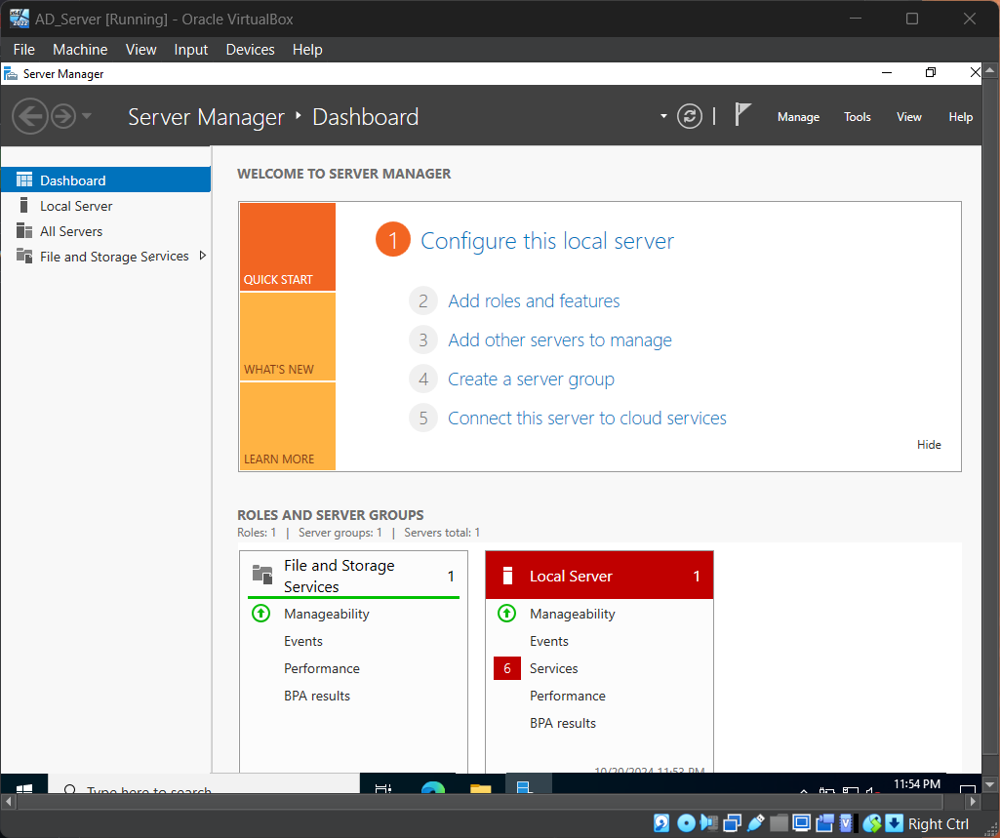
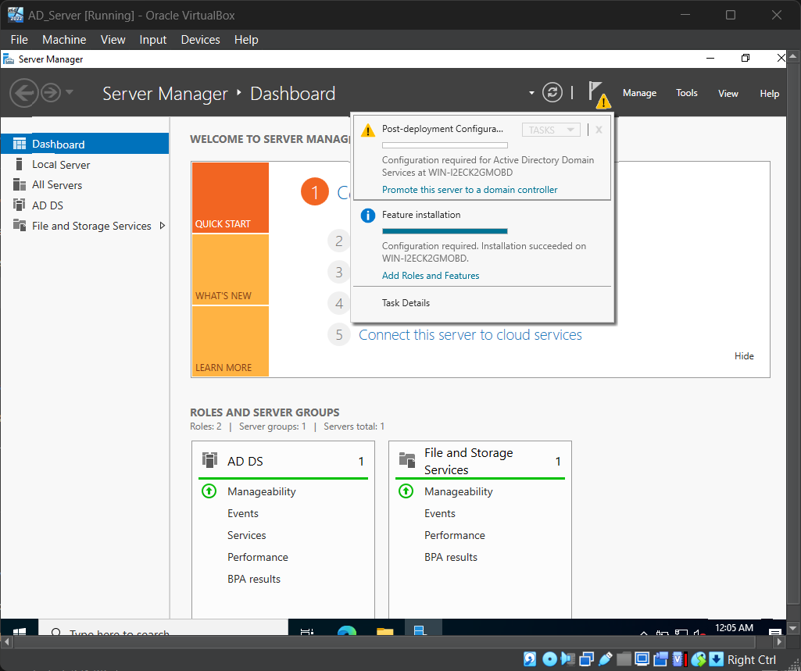
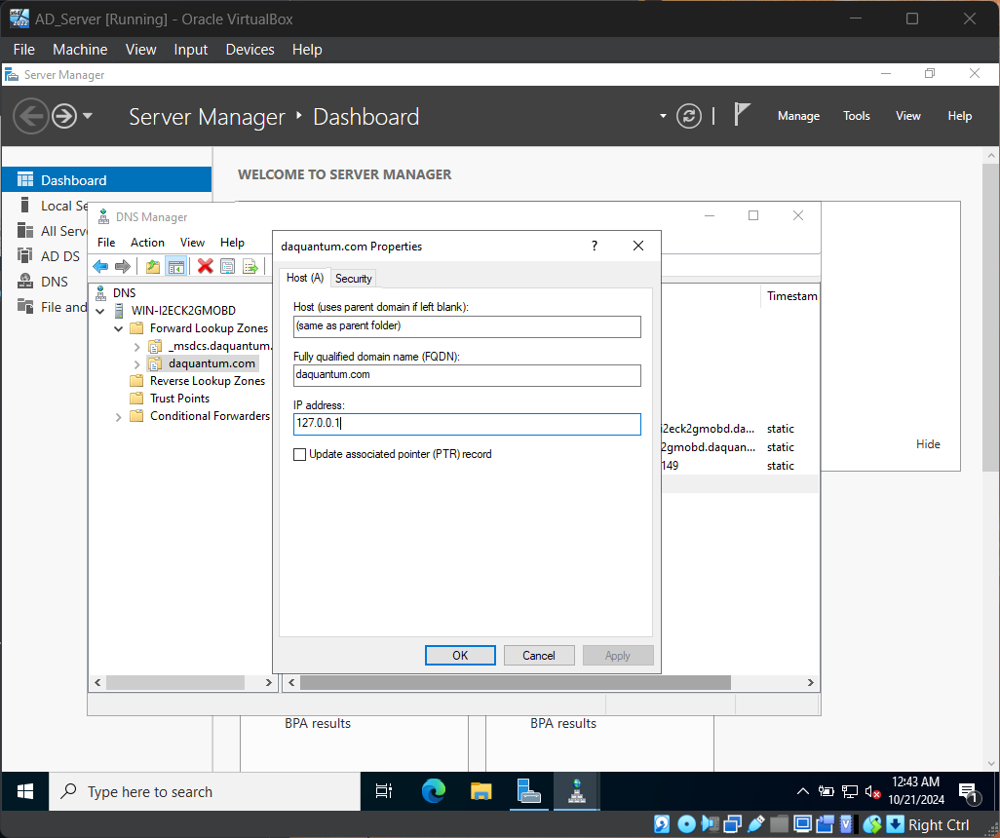
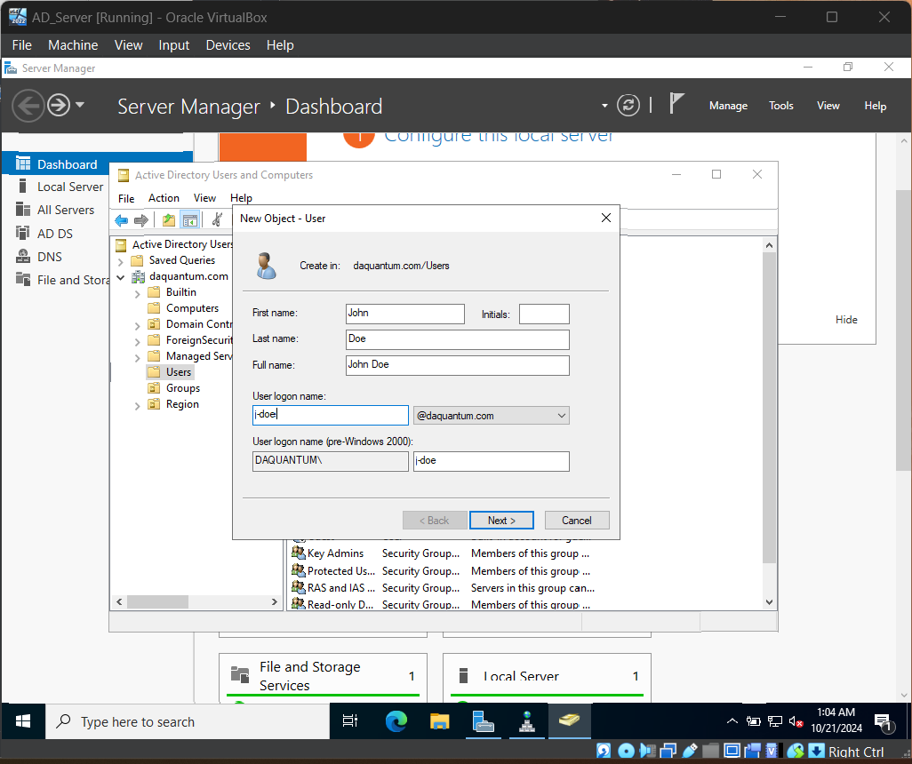
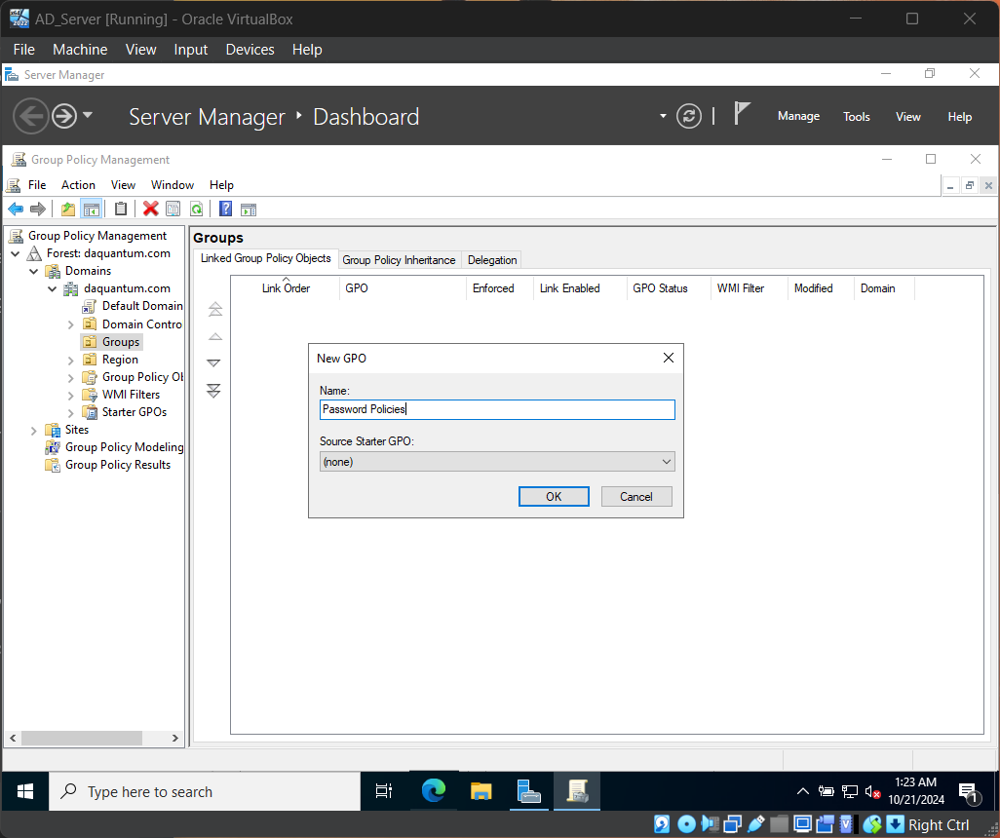

# Active Directory Project with VirtualBox

This project outlines the setup and configuration of an Active Directory (AD) environment using VirtualBox. It includes detailed steps, configuration settings, and screenshots to guide users through the process.

## Table of Contents

- [Overview](#overview)
- [Prerequisites](#prerequisites)
- [Step-by-Step Installation](#step-by-step-installation)
  - [1. Set Up VirtualBox](#1-set-up-virtualbox)
  - [2. Create a Windows Server VM](#2-create-a-windows-server-vm)
  - [3. Install Active Directory Domain Services](#3-install-active-directory-domain-services)
  - [4. Promote the Server to a Domain Controller](#4-promote-the-server-to-a-domain-controller)
  - [5. Configure DNS Settings](#5-configure-dns-settings)
  - [6. Create Organizational Units](#6-create-organizational-units)
  - [7. Create Users and Groups](#7-create-users-and-groups)
  - [8. Apply Group Policies](#8-apply-group-policies)
- [Screenshots](#screenshots)
- [Troubleshooting](#troubleshooting)
- [Contributing](#contributing)
- [License](#license)

## Overview

This project demonstrates how to set up and manage an Active Directory environment in VirtualBox. It includes user management, group policies, and common troubleshooting techniques.

## Prerequisites

- [VirtualBox](https://www.virtualbox.org/) installed
- Windows Server 2019 ISO (or later)
- Administrative access to the Windows Server VM
- Basic understanding of Windows Server and networking concepts

## Step-by-Step Installation

### 1. Set Up VirtualBox

1. **Download and Install VirtualBox:** If you haven't already, download VirtualBox from the official website and install it on your machine.
2. **Create a new VM:**
   - Open VirtualBox and click on **New**.
   - Name your VM (e.g., `AD_Server`), select **Windows** as the type, and choose the version that matches your Windows Server ISO (e.g., Windows 2022).
   - Allocate memory (at least 2 GB recommended) and create a virtual hard disk.

### 2. Create a Windows Server VM

1. **Configure VM Settings:**
   - Right-click on the VM and select **Settings**.
   - Under **System**, ensure that **Enable EFI (special OSes only)** is unchecked.
   - Under **Network**, set **Adapter 1** to **Bridged Adapter** or **NAT** (for internet access).

2. **Start the VM and Install Windows Server:**
   - Mount the Windows Server ISO in the VM settings under **Storage**.
   - Start the VM and follow the installation prompts to install Windows Server.

### 3. Install Active Directory Domain Services

1. Open **Server Manager** after logging into your Windows Server.
2. Click on **Add Roles and Features**.
3. Select **Role-based or feature-based installation** and click **Next**.
4. Choose your server and select **Active Directory Domain Services**.

### 4. Promote the Server to a Domain Controller

1. Click on the notification flag in Server Manager.
2. Select **Promote this server to a domain controller**.
3. Choose **Add a new forest** and specify the domain name (e.g., `example.local`).

4. Complete the wizard to finalize the promotion.

### 5. Configure DNS Settings

- Ensure that the server's DNS settings point to itself (127.0.0.1).

### 6. Create Organizational Units

1. Open **Active Directory Users and Computers**.
2. Right-click on the domain name and select **New** > **Organizational Unit**.
3. Name your OUs (e.g., `Users`, `Groups`, `Computers`).

### 7. Create Users and Groups

- **Creating Users:**
  1. Right-click on the `Users` OU and select **New** > **User**.
  2. Fill in the user details and complete the wizard.

- **Creating Groups:**
  1. Right-click on the `Groups` OU and select **New** > **Group**.
  2. Specify the group type and name.

### 8. Apply Group Policies

1. Open the **Group Policy Management Console (GPMC)**.
2. Right-click on the desired OU and select **Create a GPO in this domain, and Link it here**.
3. Name the GPO and configure the necessary settings.

## Screenshots

Here are some additional screenshots documenting the setup process:

1. **Server Manager Overview**
   

2. **Active Directory Users and Computers**
   

3. **Group Policy Management Console**
   

## Troubleshooting

- **User Login Issues:** Ensure the user account is not locked out and that the correct password is being used.
- **Group Policy Not Applying:** Run `gpupdate /force` on the client machine and check Event Viewer for Group Policy processing errors.

## Contributing

Contributions are welcome! Please submit issues or pull requests to improve this documentation or add additional features.

## License

This project is licensed under the MIT License - see the [LICENSE](LICENSE) file for details.

---

If you have any questions or need further assistance with the Active Directory setup in VirtualBox, feel free to reach out!
